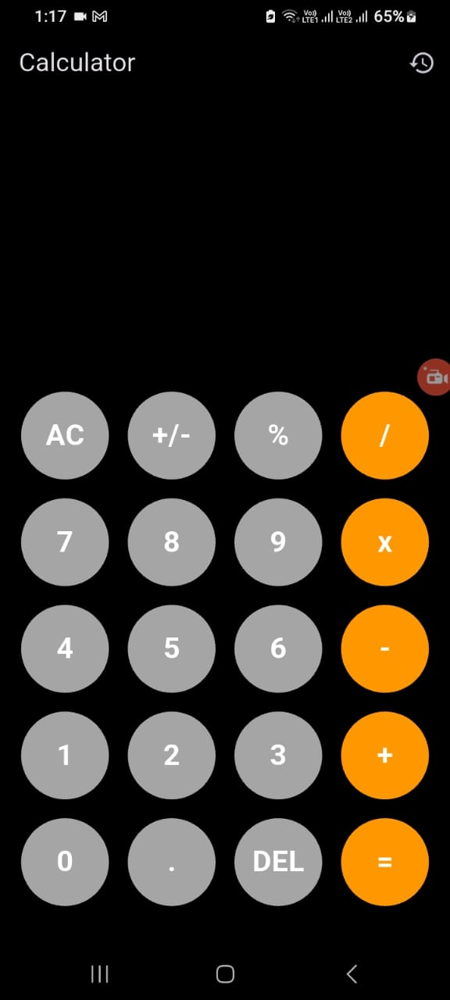
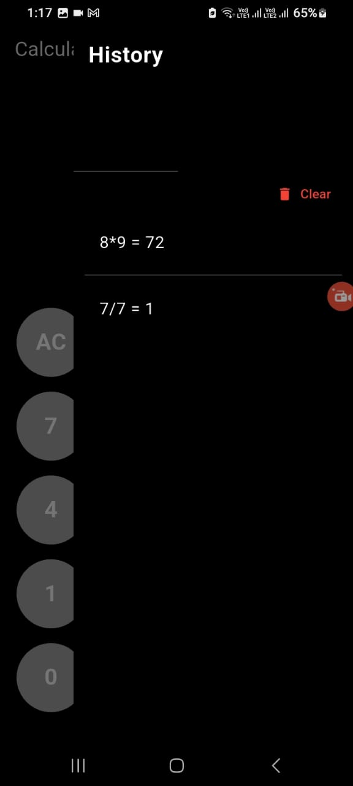

# 🧮 Flutter Calculator App

A simple yet modern **calculator app** built with Flutter.  
It supports basic arithmetic operations and maintains a **calculation history**, which can be viewed and cleared from the AppBar.

---

## 📸 Screenshots

| Calculator Screen | History Drawer |
| ----------------- | -------------- |

|
 |  |

---

## 🚀 Features

- Clean and minimal **dark-themed UI**
- **Custom reusable button widget (`MyButton`)** for consistency
- **History tracking** with option to clear all past calculations
- **Drawer integration** to view history seamlessly
- **Tabular operations layout** for easy usability

## --

## 🛠️ Concepts Used

| Concept                                 | Description                                    |
| --------------------------------------- | ---------------------------------------------- |
| **Scaffold & AppBar**                   | For app structure and top navigation           |
| **Drawer**                              | To display and manage calculation history      |
| **ListView.builder**                    | Efficient history list rendering               |
| **ListView.separated**                  | Adds dividers between history items            |
| **Expanded & Padding**                  | Flexible and responsive layout design          |
| **InkWell**                             | Button press effect handling                   |
| **Stateless & Stateful Widgets**        | Separation of UI and state logic               |
| **Custom Reusable Widget (`MyButton`)** | Maintains DRY principle for calculator buttons |

---

## 📦 Packages Used

| Package                                                       | Usage                                                                |
| ------------------------------------------------------------- | -------------------------------------------------------------------- |
| [flutter](https://pub.dev/packages/flutter)                   | Core Flutter framework                                               |
| [math_expressions](https://pub.dev/packages/math_expressions) | Parses string input into mathematical expressions and evaluates them |

---

## Getting Started

```
git clone https://github.com/SRAABIA/Calculator_Flutter
cd calculator_app
flutter pub get
flutter run
```

---
